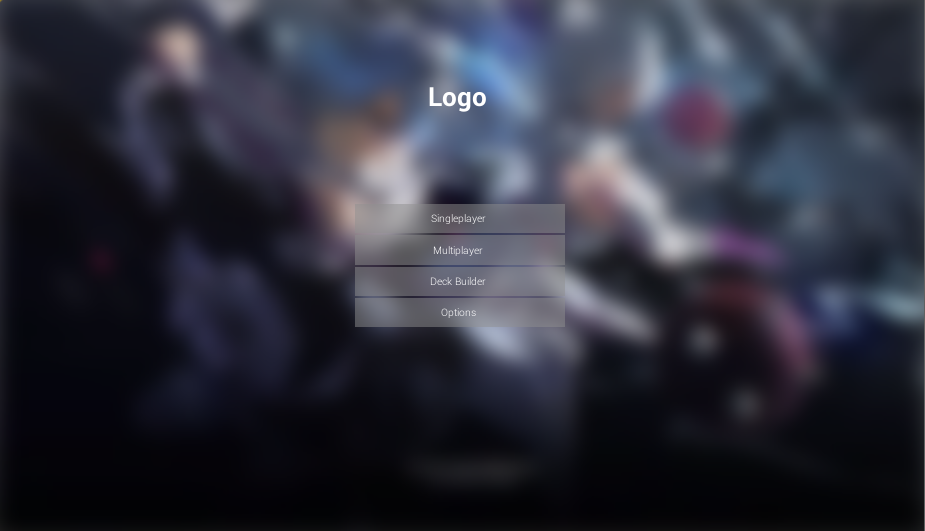

# ACG Card Game
An experimental ACG card game, developed using Unreal Engine 4 (4.18.2)

## Installation

``` 
git lfs clone https://github.com/egojump/ACGCard
```
## Relevant links
Docs (https://egojump.github.io/ACGCard/)


## Preview


Art by https://www.pixiv.net/member_illust.php?mode=medium&illust_id=57707529


## Development Require
1. Download [Ue4 Launcher](https://www.unrealengine.com/download), Then install  latest version of Unreal Engine in Launcher.
